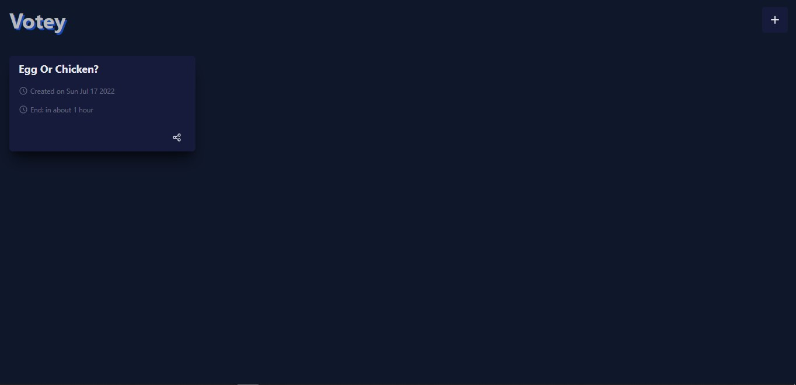
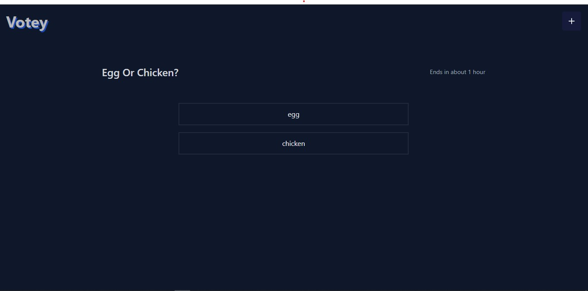
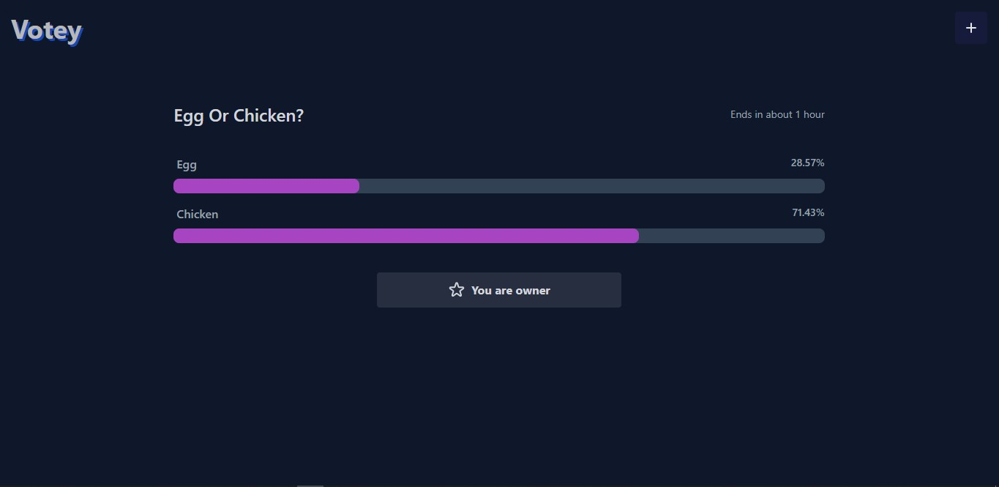

# Votey

Vote App that you can create a question or a poll and share it to others so they can vote

# Description

For the first time you visit the app, It will set a new cookie for you that you can be authenticated for next visits and save your questions and polls and share them.

## Demo

https://votey-one.vercel.app/

## Screenshots





## Acknowledgements

- [Thanks to Theo Browne](https://github.com/TheoBr)

## Tech Stack

**React, Nextjs, Typescript, Trpc, Prisma, TailwindCSS, framer-motion**

**DB:** Cloud MySql from [Planetscale](https://planetscale.com/)

## Run Locally

Clone the project

```bash
  git clone https://github.com/alireza-constantin/roundest-poki
```

Go to the project directory

```bash
  cd roundest-poki
```

Install dependencies

```bash
  npm install
```

## Create .env file

then enter your database url to these variable in .env file

```code
    DATABASE_URL=
```

Start the development server

```bash
  npm run dev
```

## Deploy on Vercel

The easiest way to deploy your Next.js app is to use the [Vercel Platform](https://vercel.com/new?utm_medium=default-template&filter=next.js&utm_source=create-next-app&utm_campaign=create-next-app-readme) from the creators of Next.js.

Check out our [Next.js deployment documentation](https://nextjs.org/docs/deployment) for more details.
